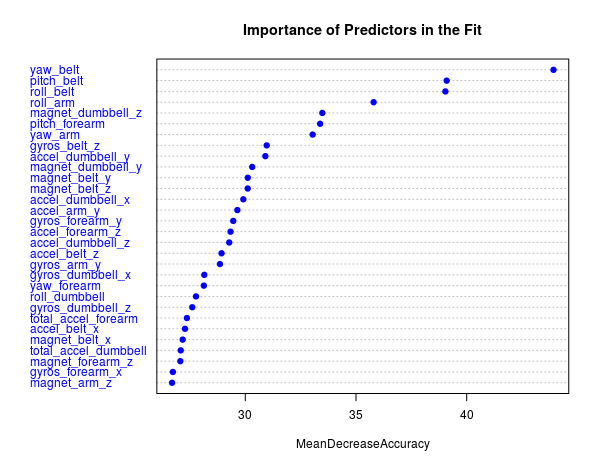
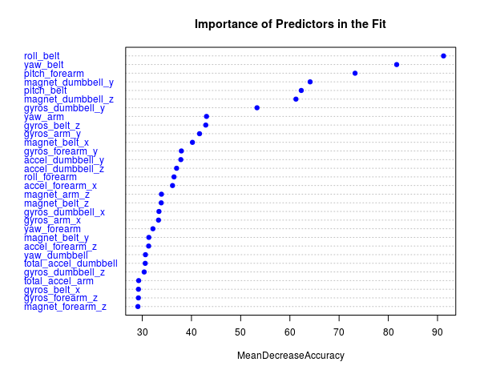
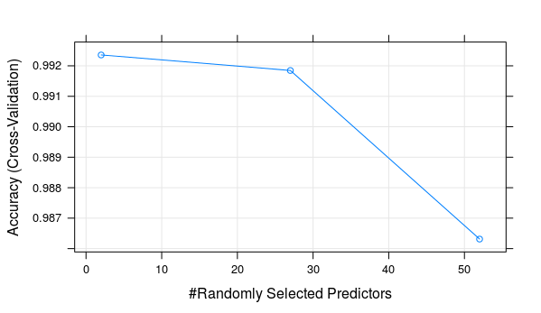
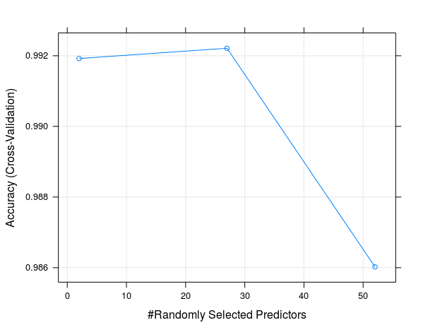

```{r setup, include=FALSE}
knitr::opts_chunk$set(echo = TRUE)
```


The dataset used is a collection of sensor readings for human activity recognition (please see references at end of this document). The aim of the original study was to attempt to judge performance of an exercise (lifting a dumbbell) qualitatively using the data produced by modern movement monitoring devices. The aim of the current project is to build a model using Machine Learning techniques that is able to correctly predict the qualitative classification using the same quantitative data from the devices.

The data consists of the output from four sensors, one on the subject's arm, one on the forearm, one on the belt, and one on the dumbbell itself. Each of these sensors monitors movement and records data on yaw, pitch, roll and acceleration in three directions, x, y and z, as well as a number of statistical properties of these recorded values such as the minimum, maximum, amplitude, standard deviation, variation, skewness, kurtosis and averages.

The response (outcome) is one of five classes, labelled A, B, C, D and E. The meanings of these levels of the response variable are explained as follows:

"Six young health participants were asked to perform one set of 10 repetitions of the Unilateral Dumbbell Biceps Curl in five different fashions: exactly according to the specification (Class A), throwing the elbows to the front (Class B), lifting the dumbbell only halfway (Class C), lowering the dumbbell only halfway (Class D) and throwing the hips to the front (Class E)." [please refer to References, below]

The five possible classes of the response make this a multi-class classification problem so we choose a model that is known to be effective for this kind of prediction problem. We tested a basic decision-tree model (**rpart**), a gradient boosting model (**gbm**), and a Random Forest model (**rf**). The basic decision-tree model (**rpart**) performed very badly with accuracy around 50% even on the training set. Gradient boosting (**gbm**) and Random Forest (**rf**) both performed very well with accuracy better than 98% on the validation set. However, Random Forest (**rf**) scored slightly better than Gradient Boosting (**gbm**) so we have used the Random Forest model as our final choice here.

We noticed that **rf** is sensitive to the choice of seed. This makes sense since the Random Forest family of models uses random choices of tuning parameters and potential
predictors. The differences between the two runs of **rf** with different seeds were that one run chose mytrys=2 while the other chose mtrys=27. This means that different predictors were used in each run.

```
library(caret)
whole_train <- read.csv("pml-training.csv")

inTrain <- createDataPartition(y=whole_train$classe, p=0.7, list=FALSE)
training <- whole_train[inTrain,]
validation <- whole_train[-inTrain,]

testing <- read.csv("pml-testing.csv")
```

### Preparing the Data

To prepare the data we remove the first 7 columns which record the user ID and various date and time variables that are not relevant to predicting the class. We also remove some potential predictors, for example the statistical variables (min, max, average, kurtosis, skewness, etc). Removing these does not appear to affect the final accuracy of the model since they are mostly NAs.

```
training <- training[,-c(1,2,3,4,5,6,7)]
validation <- validation[,-c(1,2,3,4,5,6,7)]

# remove the NAs
training <-training[,colSums(is.na(training))==0]
validation <- validation[,colSums(is.na(validation))==0]
# find the factor vars coz we want to remove any with >32 categories
col_names <- c()
n <- ncol(training)-1
for (i in 1:n) {
        if (is.factor(training[,i])){
                col_names <- c(col_names,i)
        }
}

col_namesV <- c()
n <- ncol(validation)-1
for (i in 1:n) {
        if (is.factor(validation[,i])){
                col_namesV <- c(col_namesV,i)
        }
}

# remove columns
training <- training[,-col_names]
validation <- validation[,-col_namesV]

```

We divide the training data from the file *pml-training.csv* into two sets: **training** and **validation**. After preprocessing and feature selection **training** has 13737 observations with 53 variables and **validation** has 5885 observations with 53 variables. All the predictors are numeric or integer values and the variable *classe* is the only factor variable. For the test set we use the file provided as *pml-testing.csv*


### Model: Random Forest (rf)
```
# Random Forest
set.seed(1234)

rfFit1 <- train(classe~., method = "rf", data=training, trControl = trainControl(method = "cv"), importance=TRUE)

varImpPlot(rfFit1$finalModel, main = "Importance of Predictors in the Fit", 
           pch=19, col="blue",cex=0.75, sort=TRUE, type=1)

```
Plot with seed set at 1234:



Plot with seed set at 17:



```
rfFit1
```

```
Random Forest 

13737 samples
   52 predictors
    5 classes: 'A', 'B', 'C', 'D', 'E' 

No pre-processing
Resampling: Cross-Validated (10 fold) 
Summary of sample sizes: 12365, 12363, 12364, 12364, 12362, 12362, ... 
Resampling results across tuning parameters:

  mtry  Accuracy   Kappa    
  2     0.9923561  0.9903294
  27    0.9918469  0.9896859
  52    0.9863151  0.9826851

Accuracy was used to select the optimal model using  the largest value.
The final value used for the model was mtry = 2. 
```
OOB error rate during training - estimate of out of sample error rate 0.68% which equates to an estmated generalization accuracy of 99.32%:
```
rfFit1$finalModel
```
```
Call:
 randomForest(x = x, y = y, mtry = param$mtry, importance = TRUE) 
               Type of random forest: classification
                     Number of trees: 500
No. of variables tried at each split: 2

        OOB estimate of  error rate: 0.68%
Confusion matrix:
     A    B    C    D    E  class.error
A 3904    2    0    0    0 0.0005120328
B   12 2641    5    0    0 0.0063957863
C    0   22 2370    4    0 0.0108514190
D    0    0   40 2210    2 0.0186500888
E    0    0    2    4 2519 0.0023762376
```


We can use the validation set that we set aside ourselves, rather than **rf**'s internal cross-validation, to extract a further estimate of out of sample accuracy - .9934. This agrees very closely with **rf**'s internal OOB error estimation:

```
validation <- validation[, names(validation) %in% names(training)]
predictedData <- predict(rfFit1, validation)
confusionMatrix(validation$classe, predictedData)

```
```
Confusion Matrix and Statistics

          Reference
Prediction    A    B    C    D    E
         A 1672    1    0    0    1
         B    8 1127    4    0    0
         C    0   10 1015    1    0
         D    0    0   12  952    0
         E    0    0    0    2 1080

Overall Statistics
                                        
               Accuracy : 0.9934         
                 95% CI : (0.991, 0.9953)
    No Information Rate : 0.2855         
    P-Value [Acc > NIR] : < 2.2e-16      
                                         
                  Kappa : 0.9916         
 Mcnemar's Test P-Value : NA             

Statistics by Class:

                     Class: A Class: B Class: C Class: D Class: E
Sensitivity            0.9952   0.9903   0.9845   0.9969   0.9991
Specificity            0.9995   0.9975   0.9977   0.9976   0.9996
Pos Pred Value         0.9988   0.9895   0.9893   0.9876   0.9982
Neg Pred Value         0.9981   0.9977   0.9967   0.9994   0.9998
Prevalence             0.2855   0.1934   0.1752   0.1623   0.1837
Detection Rate         0.2841   0.1915   0.1725   0.1618   0.1835
Detection Prevalence   0.2845   0.1935   0.1743   0.1638   0.1839
Balanced Accuracy      0.9974   0.9939   0.9911   0.9972   0.9993
```
```
postResample(predictedData, validation$classe)

#  Accuracy     Kappa 
# 0.9933730 0.9916164 

```
```
plot(rfFit1)
```
Plot with seed set at 1234:


Plot with seed set at 17:



### Using our model to predict the outcomes for the test set
```
predict(rfFit1, newdata = testing)

```
```
 [1] B A B A A E D B A A B C B A E E A B B B
 Levels: A B C D E

```

### References


Velloso, E.; Bulling, A.; Gellersen, H.; Ugulino, W.; Fuks, H. Qualitative Activity Recognition of Weight Lifting Exercises. Proceedings of 4th International Conference in Cooperation with SIGCHI (Augmented Human '13) . Stuttgart, Germany: ACM SIGCHI, 2013. 

http://groupware.les.inf.puc-rio.br/har (see the section on the Weight Lifting Exercise Dataset)

The training data for this project are available here:

https://d396qusza40orc.cloudfront.net/predmachlearn/pml-training.csv

The test data are available here:

https://d396qusza40orc.cloudfront.net/predmachlearn/pml-testing.csv

